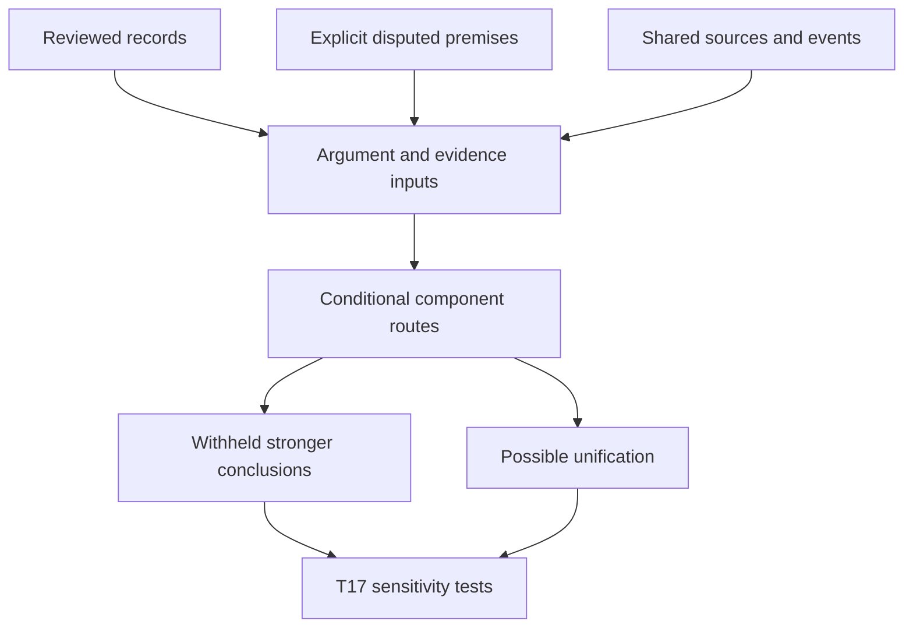

# T16 — Evidence and premise dependency map

**Submitted for later joint R18 review; no cumulative confidence assessment or worldview ranking is made here.** This step maps the accepted corpus under G2’s conditional scope. It distinguishes a premise that would make a proposal work from evidence that the premise is true.

The strongest integrated proposal has a real potential benefit: one constrained conscious foundation could connect subjective experience, shared physical regularity, enduring personal relationships, purposeful development and moral reasons. That benefit depends on the same grounding relations doing explanatory work across domains. It does not follow from using the word “consciousness” in each domain. Individuation, actual continuation, timeless manifestation, intention, normative worth and legitimate authority remain additional commitments whose warrant must be assessed separately.

The strongest selected countercase combines causal neural constraints, unresolved experience timing and information access, culturally variable and distressing reports, and contested explanatory, identity and normative bridges. It preserves physical identity, psychophysical laws, experiential constitution and plural or impersonal alternatives. It does not establish an ordinary cause for each NDE by naming possibilities, and it does not turn missing likelihoods into equal support.

## How to read the map

`dependency_map.json` contains typed claim anchors, project bridge premises, inference routes, nine component targets, cross-cutting explanatory targets and dependence clusters. Each claim anchor retains its exact accepted statement, review ID, source IDs, locators, reliability, inference strength and limitations. Source anchors retain access/version details and identifiers. No new source was inspected.

Within a route, `required_inputs` are **conjunctive**. Separate supporting routes for a component are alternatives, without an assumption of statistical independence or exhaustiveness. `evidence_inputs` document observations, attributions and prior conditional reasoning; they do not certify the truth of an author’s premises. Edges explicitly distinguish these roles.

Several positive routes are **condition or coherence maps**, not independent evidence: specifying a timeless ground, universal dependence, actual preservation or restoration partly states what is being investigated. Each route therefore has a `T17_use` field and identifies any target-restating assumptions. The design route instead compares a **candidate** agent with alternatives under independently warranted expectations; it does not assume an actual designer and then infer one.

This is a selective explanatory map, not a copy of every accepted record. Detailed case dossiers and domain packets remain the evidence record. Neal is retained as narrative/prediction context and an unresolved provenance gate; Moorjani remains a screened, deferred lead, not an independently corroborated acquisition route. Their material is removed in the all-retrospective sensitivity design rather than silently counted as additional positive evidence. The named acquisition routes selected here are Reynolds, dentures/TG, Alexander and the prospective studies, with their different documentary roles and limits retained.

## Nine components and their connecting assumptions

| Component | Strongest mapped positive route | Principal constraint or counterroute |
|---|---|---|
| H-F: fundamentality | Phenomenal explanatory demand plus a defended epistemic-to-metaphysical bridge and basic-ontology premise; separately, an experiential ultimate ground added to a PSR argument. | Papineau’s selected identity/phenomenal-concept challenge; irreducibility or necessary concrete reality alone does not establish basic conscious reality. |
| H-U: universal dependence | One conscious subject **or conscious whole** grounds all subjects in a stated domain through a defensible individuation and embodiment relation. | Combination/decomposition and public-lawfulness burdens. Distinct persons need not be numerically identical to the whole. This route specifies what must work, not an observed universal subject. |
| H-B: brain independence | Accurate specific acquisition independently timed to excluded processes under a specified dependence model, with ordinary access assessed and an alternative model constrained. | Present timing/access gaps and actual causal neural contributions. Neither missing measurement nor generic hearing/reconstruction possibilities settle the case. |
| H-S: personal survival | Actual subjectivity beyond irreversible bodily death plus a defended same-person identity relation. | Resuscitation does not cross the stipulated endpoint; a faithful copy or enlarged-history assumption supplies no independent proof of continued subjectivity. |
| H-T: timelessness | M2: a non-successive foundation grounds ordered temporal persons through an intelligible relation. | Perfect knowledge of irreducible changing presentness may challenge that model. Relativity, relational observables and reported timelessness do not establish an actual non-successive bearer. |
| H-P: preservation | A specified item actually persists; H-S also entails the narrow preservation of continuing subjectivity. | Information, ownership, worthwhile relationships and value are different targets. M4 can preserve a record while the original person ceases. |
| H-I: intention | Independently constrained candidate preferences make order or conscious life more expected than under a specified alternative. | Observer selection, unspecified measures and preferences fitted after the observation. Conscious production is not itself intended production. |
| H-G: goodness | An independently intelligible good nature, justified permission and actual same-victim restoration could form a coherent account of governance and final loss. | Suffering and nonresistant nonbelief challenge specified power/knowledge/perfect-love packages. Restoration assumed in a defense is not observed, and compensation alone does not justify permitting harm. |
| H-A: authority | A good-nature account with a legitimate normative relation and identifiable obligations. | Descriptive unity, creation, power and sanctions do not supply that relation. Railton supplies a developed selected naturalist countercase; other moral-family originals remain missing. |

These nine assessments are separate **without being logically independent**. H-S entails narrow H-P subjectivity. A specified brainless survival model also entails its H-B instance; replacement-brain survival need not exclude dependence on a brain. None of these relations licenses transferring confidence to the whole package.

**X-EX, explanation of existence and lawfulness, remains indispensable.** H-F alone does not explain why concrete reality exists or why these laws obtain. Physical primitives, psychophysical laws, experiential constituents and a conscious ground all require an explicit stopping point. Compare the independent adjustable commitments symmetrically, rather than counting ontological nouns.

## What can genuinely combine, and what would be counted twice

The selected qualia exchange is traced through A-T05-001–004 and A-T12-001–005. Reuse of Chalmers and Papineau across tasks is one philosophical lineage, not several replications. The existence routes A-T10-002–005 share explanatory and preference assumptions; a life-valuing designer premise used to interpret life evidence cannot return as independent evidence of that designer’s goodness. The time and identity routes A-T11-002–005 and A-T13-001–005 require explicit bearers and relations, not a transfer from unusual duration to cosmic timelessness.

A-T14-001–003 preserve three different claims: worthwhile endurance can **enhance** significance, endurance may be claimed **necessary** for a selected kind of significance, and endurance **actually occurs**. Supporting one does not establish the others. Finite benefits may retain value under a defended normative account while the user’s question about cosmic enduring significance remains unanswered. Williams’s original chapter is now inspected and reviewed; wider debate and some exact versions remain open.

A-T15-001–006 distinguish value, impartial concern, authority, restoration and permission. If survival is assumed to explain restoration, and restoration helps defend goodness, that defense cannot then count as new evidence for survival. Howard-Snyder’s inspected 1996 argument and Schellenberg’s inspected 2025 Précis are selected opposing positions, not a direct historical exchange. The former’s temporary-delay reply has stated limits; neither it nor uninspected theodicies can be treated as a completed answer to all hiddenness or suffering arguments.

The machine map preserves all fourteen G2 dependence groups. In particular:

- Neal’s and Alexander’s related phases share persons and reporting chains.
- AWARE II’s prospective and selected community arms retain different ascertainment. Excerpt/full article versions are not extra studies; actual exposed-and-interviewed target opportunities remain incompletely identified.
- The dentures anecdote’s documentary link to the Dutch article is not established cohort membership. Its repeated nurse interviews remain a TG witness chain.
- Distinct Bede narratives share a literary/translation source without becoming one event. IANDS/Liège overlap is uncertain, not established duplication or independence.
- Drug/placebo conditions, anesthesia/sleep participants, repeated macaque trials and one stimulated human patient retain their actual units. Theory-test publications and replies are not replications.

## Alternatives and claim gates

`alternatives_matrix.json` compares six overlapping T03 families under the same C1–C6 questions: coherence, scope, independent warrant/cost, fit, discrimination and remaining problems. All thirty-six comparison cells are labeled **project reconstructions**, with exact accepted attribution anchors where available. That prevents an operational comparison from being mistaken for a surveyed strongest author position.

The representation is asymmetric. Papineau’s selected originals, Chalmers’s selected originals and Kastrup’s inspected text provide useful anchors. A short Swinburne identity argument does not close the developed substance-dualism gap. Strong emergence, plural idealism, some panpsychist replies and illusionism remain underrepresented. Moral naturalism and a selected divine nature/command account have positive originals; developed constructivist and non-natural realist originals remain missing. No broad winner is licensed by defeating a reconstruction of a missing rival.

`conclusion_gate_map.json` explicitly withholds twelve classes of stronger conclusion. Each is tied to G2 gap IDs, repair IDs or additional evidence requirements. These include broad mind/morality rankings; decisive empirical acquisition claims; corrected pooled rates; global cultural invariance; a neural-theory winner; necessary-conscious-ground/design verdicts; actual survival/timelessness; meaning-necessity claims; and actual good governance/restoration. Repairs are claim-triggered prerequisites, not active tasks. Completing a literature repair would not itself fill absent event measurements or establish metaphysical actuality.

## T17 handoff

`sensitivity_handoff.json` supplies all eight G2 tests with exact routes, premises, cases and dependence groups. T17 must track every component and distinguish altered record reliability, altered inference and component confidence.

1. Remove Reynolds, selected for specific surgical details and the inspected technical dispute; separately remove dentures/TG under the alternative witness/object-location criterion. These choices test different strengths, not a truth ranking.
2. Remove all retrospective narratives and the selected community arm; retain genuinely prospectively recruited study arms at their real denominators. Remove a retrospective comparator without discarding an independently distinguishable drug/placebo contrast.
3. Withdraw uncertain shared-sample contributions without declaring them confirmed duplicates.
4. Vary psychological, organism and simple-subject identity; distinguish strict identity from successor concern and M1–M4 preservation.
5. Reject endurance-required-for-value, unity-to-obligation and consciousness/creation-to-authority bridges individually; retain enhancement and other normative alternatives where applicable.
6. Remove global PSR, the modal bridge and independently warranted life-valuing preferences one at a time.
7. Symmetrically remove human fusiform stimulation or macaque thalamic stimulation, and weaken report/awareness proxies separately while preserving the observed behavioral changes.
8. Restrict claims about authors to inspected original defenders/replies; label missing variants and withhold rankings dependent on weaker reconstructions.

No test has been executed in T16 and no cumulative confidence score has been assigned. **Next: T17’s conditional confidence and sensitivity assessment**, followed by T18’s synthesis and the scheduled joint R18 review/G3 adjudication.

The existing request remains open: Sam Parnia, *Reply to AWAreness during REsuscitation and EEG activity*, DOI **10.1016/j.resuscitation.2023.110080**. Its bibliographic identity was verified earlier in `state/G2_source_request.json`; its full text is uninspected. These mapping and sensitivity tasks can proceed while it is unavailable. New material must receive separate review, with affected downstream statements reassessed.
